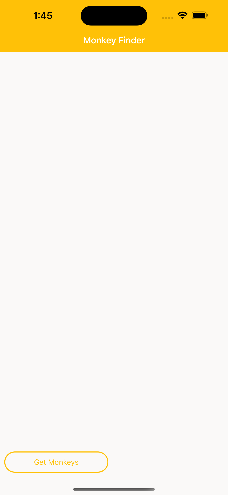

# Shravan Reddy Nalabol - W977T652

# PART 1 - Displaying Data

<table>
<tr>
<th>Ios</th>
</tr>
<tr>
<th></th>
</tr>
</table>

# PART 2 - MVVM

<table>
<th>Ios</th>
</tr>
<th>

</th>
</tr>
</table>

# PART 3 - Navigation

<table>
<tr>
<th>Ios</th>
</tr>
<tr>
<th></th>
</tr>
</table>

# PART 4 - Platform Features

<table>
<th>Ios</th>
</tr>
<th>

</th>
</tr>
</table>

# PART 5 - Collection View

<table>
<tr>
<th>Ios</th>
</tr>
<tr>
<th></th>
</tr>
</table>

# PART 6 - App Themes

<table>
<tr>
<th>Android</th>
</tr>
<tr>
<th></th>
</tr>
</table>
